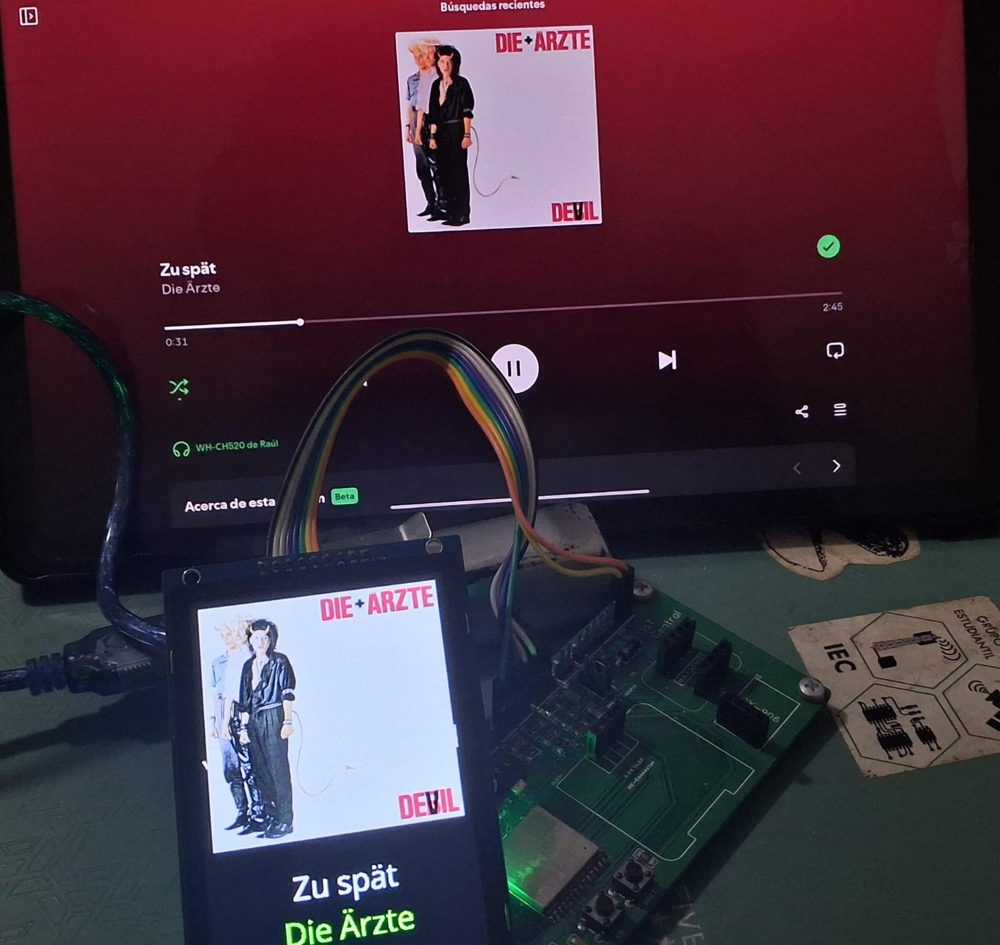

# Spotify ESP32-S3 | MicroPython

This project is possible thanks to the [**st7789_mpy**](https://github.com/russhughes/st7789_mpy.git) library made by [**russhughes**](https://github.com/russhughes). This consist in a spotify kinda-like-widget app that runs into an ESP32-S3 and shows the your current play in a TFT-display using the spotify official API, written in **MicroPython**.



---

## Requirements

The hardware requirements are listed below:
- ESP32-S3 (shall be an S3, as a normal ESP32 have little RAM limitations).
- TFT-display (personally, I used a ST7796S 320x480 display, but any TFT display compatible with the library should work).

Additionaly, go to [Spotify for Developers](https://developer.spotify.com/) and login with your account. Go to dashboard and select ***Create app*** and add the information requested. In here, it is important to define a redirect uri (if you don't have an specific one, a placeholder like `https://example.org/callback` shall work), and the `Web API` is selected in the section ***Which API/SDKs are you planning to use?***. When created, a `Client ID` and `Client Secret` will be created. It is important to keep these variables, as they will be used in order to get the *refresh token*.

**Note:** Sadly, in order to use the spotify API, a premium subscription is needed.

---

## Setup

This setup consist on getting the refresh token first, and then burn your ESP32-S3 with the correct credentials.

### Refresh token
A refresh token script is already created in the `token/` directory. Here, create a virtual environment (I recommend that this is done in the token directory) as:

```
python -m venv .venv
```

Then activate it like

*macOS/Linux*
```
source .venv/bin/activate
```

*Windows*
```
.venv\Scripts\activate.bat
```

**Note:** please check depending on your virtual environment and your OS.

Before running the script, install all the dependencies inside `requirements.txt` (assuming the virtual environment is already active) as:

```
pip install -r requirements.txt
```

If everything is done correctly, run the `spotify_client.py` script as:

```
python spotify_client.py
```

Follow the steps from the script in order to get the **refresh token**.

### ESP32-S3

In order to run this, the **ST7789 library** is needed. I recommend to use the precompiled binary in the `firmware/` directory. If you prefer, you can manually compile it (see [st7789_mpy](https://github.com/russhughes/st7789_mpy.git)).

Assuming a working binary is used and flashed inside your ESP32-S3 (you can use esptool or Thonny). All inside the `mcu/` directory shall me uploaded into your ESP32-S3. Before uploading, go to `credentials.json` and modify all instances with your personal credentials.

For your TFT-display, modify all your parameters inside the `tft_handler` class in `util/tft_handler.py` depending on your hardware & connections (pins, dimensions, configuration, etcetera).

When all the configuration and parameters are done, upload all the project. If everything is done correctly, your app should work just fine!

---

**Note:** as it right now, spotify updated its workflow so that the refresh token shall be updated every 3 months, so this shall be updated in the microcontroller as well (this was changed in the creation of this project).
- **Work in progress:** remotely change the refresh token, as it needs to go through all the spotify's authentication process.